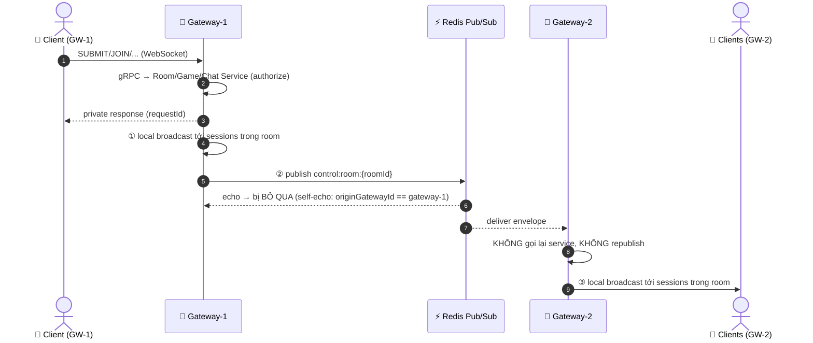

# 📡 Distributed Control Event Fanout (Cross-Gateway)

> **Dự án:** Multiplayer Drawing & Guessing Game
> **Tài liệu:** Đồng bộ control events giữa nhiều Realtime Gateway qua Redis Pub/Sub
> **Phiên bản:** `v1.0.0` (TV6)
> **Trạng thái:** `Active / Implemented`

---

## 📌 1. Vì sao cần Redis Pub/Sub cho control events

Hệ thống hỗ trợ chạy **nhiều Realtime Gateway** song song (`gateway-1`, `gateway-2`, ...) để scale số kết nối WebSocket. Mỗi Gateway chỉ giữ **WebSocket sessions cục bộ** của mình.

Drawing (binary) đã có fanout phân tán từ TV3 qua channel `drawing:room:{roomId}`. Nhưng trước TV6, các **control events** (PLAYER_JOINED, GAME_STARTED, CHAT_MESSAGE, ...) chỉ được broadcast tới sessions đang kết nối **cùng Gateway** với người gửi → người chơi ở Gateway khác không nhận được chat, không biết ai vào phòng, không chuyển sang màn chơi...

TV6 bổ sung fanout phân tán cho control events, **tái dùng đúng pattern** của drawing Pub/Sub.

---

## 🏗️ 2. Mô hình Local + Distributed Fanout



Nguyên tắc:
- **① ② chạy song song** tại Gateway gốc — Redis fail không làm hỏng local broadcast (publish failure chỉ WARN).
- **Remote path kết thúc ở local WebSocket broadcast** — không loop, không republish.
- Gateway nhận **không** gọi lại Room/Game/Chat Service (Gateway gốc đã authorize).

---

## 📮 3. Channel & Envelope

### Channel strategy

Giống drawing: **một channel mỗi room**.

```
control:room:{roomId}     # ví dụ: control:room:ABC123
```

Subscriber dùng pattern `control:room:*` (1 subscription duy nhất cho mọi room — không tạo hàng nghìn subscriber connection, không dùng KEYS).

### ControlEventEnvelope

```json
{
  "originGatewayId": "gateway-1",
  "targetRoomId": "ABC123",
  "eventType": "PLAYER_JOINED",
  "eventId": "6a2f1c88-...",
  "payload": "{\"type\":\"PLAYER_JOINED\",\"roomId\":\"ABC123\",...}"
}
```

| Field | Ý nghĩa |
|---|---|
| `originGatewayId` | Gateway đã authorize & publish ban đầu. `"game-service"` khi xuất phát từ Game Service. |
| `targetRoomId` | Room đích — subscriber chỉ broadcast tới local sessions bound với room này (**room isolation**). |
| `eventType` | Loại event (chẩn đoán/log). |
| `eventId` | UUID của lần publish này (chẩn đoán/truy vết dedup). |
| `payload` | Chuỗi JSON **client-facing** — giống hệt payload broadcast local, đã an toàn cho mọi thành viên room. |

**Quy tắc bảo mật payload:** envelope chỉ mang payload đã được build bằng các safe-mapping có sẵn (`createBroadcastJson`, `createChatMessageBroadcastJson`, `createGuessCorrectBroadcastJson`, `createGameStateJson` — GAME_STARTED đã strip secretWord ở Game Service). KHÔNG serialize proto object trực tiếp.

---

## 🔇 4. Self-echo & Loop prevention (bắt buộc phía server)

```java
// ControlRedisSubscriber.handleMessage
if (gatewayInstanceId.equals(envelope.originGatewayId())) {
    return; // self-echo ignored — đã local-broadcast trước khi publish
}
```

- Event publish bởi gateway-X sẽ nhận lại chính nó từ Redis → **bỏ qua** (đã broadcast local ở bước ①).
- Event nhận từ Redis **không bao giờ** được publish lại → không loop.
- Event từ `game-service` (originGatewayId = `"game-service"`) **không** bị suppress — mọi Gateway (kể cả Gateway của client gây ra transition) đều phải fanout.

Kết quả E2E xác nhận (CG-012): một logic event → **đúng 1 lần** trên mỗi client nhận.

---

## 🗂️ 5. Event Classification Table

| Event | Scope | Redis Fanout | Secret Safe | Ghi chú |
|---|---|---|---|---|
| `PLAYER_JOINED` | ROOM | ✅ YES | ✅ YES | |
| `PLAYER_LEFT` | ROOM | ✅ YES | ✅ YES | |
| `GAME_STARTED` | ROOM | ✅ YES | ✅ YES | secretWord đã bị strip khỏi response StartGame (Game Service); drawer lấy qua GET_GAME_STATE (viewer-filtered) |
| `ROUND_STARTED` | ROOM | ✅ YES | ✅ YES | publish bởi **game-service**; chứa round + drawerId + status; Gateway nhận cũng refresh DrawingRoomStateCache |
| `ROUND_ENDED` | ROOM | ✅ YES | ✅ YES | publish bởi game-service; không lộ từ của vòng sau |
| `GAME_FINISHED` | ROOM | ✅ YES | ✅ YES | publish bởi game-service; Gateway nhận evict DrawingRoomStateCache |
| `PLAYER_GUESSED_CORRECTLY` | ROOM | ✅ YES | ✅ YES | chỉ playerId + scoreAwarded — KHÔNG chứa đáp án/alias |
| `CHAT_MESSAGE` | ROOM | ✅ YES | ✅ YES | chat-service vẫn validate membership trước khi Gateway publish |
| `DRAW_EVENT` / `DRAW_BATCH_EVENT` / `CANVAS_CLEARED` (JSON fallback) | ROOM | ✅ YES | ✅ YES | binary fast-path vẫn dùng `drawing:room:*` (không đổi); JSON path giờ kiểm tra drawer + round như binary |
| `GUESS_RESULT` | **PRIVATE** | ❌ NO | viewer-specific | chỉ gửi về session người đoán (sendToSession + requestId) |
| `ERROR` | **PRIVATE** | ❌ NO | ✅ | về đúng session gửi request |
| `GAME_STATE` (GET_GAME_STATE response) | **PRIVATE** | ❌ NO | viewer-specific | secretWord chỉ có cho drawer |
| `ROOM_CREATED` / `ROOM_JOINED` / `ROOM_LEFT` / `SESSION_RESUMED` / `GAME_FINISHED_ACK` | **PRIVATE (ACK)** | ❌ NO | ✅ | response trực tiếp theo requestId |
| `APP_PONG` | **PRIVATE** | ❌ NO | ✅ | heartbeat |

---

## 🧩 6. Thành phần

```
Services/realtime-gateway/src/main/java/com/drawgame/realtime_gateway/
├── control/
│   ├── ControlEventRouter.java        # điểm vào: local broadcast + Redis publish
│   ├── LocalRoomBroadcaster.java      # wrapper ConnectionManager (room-scoped text)
│   └── redis/
│       ├── ControlEventEnvelope.java  # envelope record
│       ├── ControlEventCodec.java     # (de)serialize Jackson, 1 chỗ duy nhất
│       ├── ControlRedisPublisher.java # publish control:room:{roomId} (reactive)
│       └── ControlRedisSubscriber.java# subscribe control:room:*, self-echo skip,
│                                     # refresh/evict DrawingRoomStateCache
Services/game-service/src/main/java/com/drawgame/game/service/component/
└── GameControlEventPublisher.java     # publish ROUND_STARTED/ROUND_ENDED/GAME_FINISHED
                                        # (origin "game-service", blocking template —
                                        #  chạy trên RoundScheduler executor, không phải Netty loop)
```

Wiring trong `GameCommandHandler`: mọi call site room-broadcast cũ (`connectionManager.broadcastToRoom*`) nay đi qua `controlBroadcast(roomId, senderSessionId, eventType, payloadJson)` — helper null-safe (test cũ không router → fallback local-only).

## 🔒 7. Trust boundary

- Browser → WebSocket → Gateway → (gRPC authorize) → Redis. **Browser không bao giờ publish Redis trực tiếp.**
- Gateway vẫn authorize trước khi publish (drawer check, host check, chat membership...) — remote Gateway tin tưởng envelope vì chỉ Gateway/game-service nội bộ mới publish được.
- JSON drawing path giờ cũng kiểm tra drawer + round qua `DrawingRoomStateCache` (trước TV6: CLEAR_CANVAS JSON không kiểm tra — lỗ hổng D7b đã fix).

## ⚡ 8. Độ tin cậy

- Redis publish/receive failure: WARN log, **không crash Gateway**, không block local path (reactive, không blocking call trên Netty loop).
- Control events là tần suất thấp — không áp lossy drop/coalescing kiểu drawing; đi qua `BoundedOutboundQueue` outbound như text frames khác.
- Best-effort fanout: nếu một Gateway bỏ lỡ event (Redis hiccup), client vẫn tự sửa qua GET_GAME_STATE poll 5s (safety net có sẵn).

## 🧪 9. Kiểm chứng (E2E thực tế, 2 Gateway Docker)

`tools/e2e/ws-e2e.mjs` — **81/81 PASS** (2 run liên tiếp), gồm CG-001→CG-015:
PLAYER_JOINED/LEFT/GAME_STARTED/ROUND_STARTED/GAME_FINISHED/PLAYER_GUESSED_CORRECTLY/CHAT_MESSAGE cross-gateway 2 chiều, room isolation (CG-011), không self-echo/duplicate (CG-012), không lộ secretWord (CG-013 — mọi frame WS tới guesser được inspect), drawing regression (CG-014), burst events (CG-015).

Unit tests: `ControlRedisSubscriberTest` (9 test — envelope round-trip, self-echo, room routing, event type, cache refresh, malformed drop).
