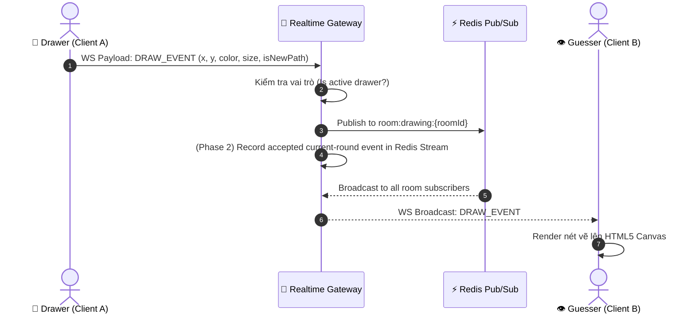

# 🎨 Real-Time Drawing Protocol Specification

> **Dự án:** Multiplayer Drawing & Guessing Game  
> **Tài liệu:** Giao thức đồng bộ nét vẽ thời gian thực (Real-time Drawing Protocol)  
> **Phiên bản:** `v1.2.0`  
> **Trạng thái:** `Active / Standardized`  

> **Recovery note:** Tài liệu này là source of truth cho live drawing wire format. Reconnect, current-round replay, Redis Stream keys, cleanup và recovery/live ordering được chốt riêng tại [`reconnect-canvas-recovery.md`](reconnect-canvas-recovery.md). Task preparation đó chưa có nghĩa canvas recovery đã được implement.

---

## 📌 1. Tổng quan (Overview)

**Drawing Protocol** quy định định dạng dữ liệu, cơ chế đóng gói và luồng giao tiếp WebSocket giữa Client (React Canvas) và Backend (Realtime Gateway, Redis Pub/Sub) nhằm đảm bảo:
- **Độ trễ thấp (Low Latency):** Đồng bộ nét vẽ tức thì với tốc độ 60 FPS (~16ms/frame).
- **Độ phân giải độc lập (Resolution Independence):** Chuẩn hóa tọa độ theo tỉ lệ phần trăm ($0.0 \to 1.0$) để hiển thị chuẩn xác trên mọi kích thước màn hình (Mobile, Tablet, Desktop).
- **Tính toàn vẹn (State Consistency):** Định nghĩa dữ liệu cần thiết cho live drawing; current-round recovery khi reconnect được quy định và triển khai theo tài liệu contract riêng.

---

## 🏗️ 2. Kiến trúc Luồng Dữ liệu (Data Flow Architecture)



---

## 📊 3. Định dạng Dữ liệu & Data Models

### 3.1. Cấu trúc Điểm Vẽ (`DrawPoint`)

Tất cả các hành động vẽ trên Canvas được biểu diễn dưới dạng các điểm nối tiếp nhau.

```typescript
export interface DrawPoint {
  x: number;          // Tọa độ X đã chuẩn hóa (0.0 đến 1.0) hoặc Pixel X
  y: number;          // Tọa độ Y đã chuẩn hóa (0.0 đến 1.0) hoặc Pixel Y
  color: string;      // Mã màu Hex (ví dụ: "#EF4444")
  size: number;       // Độ dày nét vẽ (pixel, ví dụ: 4)
  isNewPath: boolean; // true: Bắt đầu đường nét mới (PointerDown); false: Nối tiếp nét (PointerMove)
  timestamp?: number; // Unix timestamp (ms) thời điểm vẽ
}
```

### 3.2. Chuẩn hóa Tọa độ (Coordinate Normalization)

> [!TIP]
> **Công thức chuẩn hóa tọa độ:**  
> $$x_{normalized} = \frac{x_{pixel}}{W_{canvas}}$$  
> $$y_{normalized} = \frac{y_{pixel}}{H_{canvas}}$$  
> Khi hiển thị tại máy nhận:  
> $$x_{pixel\_render} = x_{normalized} \times W_{local\_canvas}$$  
> $$y_{pixel\_render} = y_{normalized} \times H_{local\_canvas}$$

---

## 📡 4. Chi tiết các Loại Sự Kiện (Event Payloads)

### 4.1. Sự kiện Nét Vẽ (`DRAW_POINT` / `DRAW_STROKE`)

Gửi khi người vẽ nhấn giữ và di chuyển chuột/bút cảm ứng trên Canvas.

#### 🔹 Client Payload (Client $\rightarrow$ Server):
```json
{
  "type": "DRAW_POINT",
  "requestId": "req_abc123xyz_1700000000000",
  "payload": {
    "roomId": "room-8888",
    "point": {
      "x": 0.4523,
      "y": 0.3112,
      "color": "#3B82F6",
      "size": 6,
      "isNewPath": false
    }
  }
}
```

#### 🔹 Server Broadcast Payload (Server $\rightarrow$ Room Clients):
```json
{
  "type": "DRAW_EVENT",
  "payload": {
    "roomId": "room-8888",
    "drawerId": "user_123",
    "point": {
      "x": 0.4523,
      "y": 0.3112,
      "color": "#3B82F6",
      "size": 6,
      "isNewPath": false
    }
  }
}
```

---

### 4.2. Sự kiện Xóa Bảng (`CLEAR_CANVAS`)

Gửi khi người vẽ bấm nút **Clear Canvas** để làm sạch toàn bộ hình vẽ.

#### 🔹 Payload:
```json
{
  "type": "CLEAR_CANVAS",
  "requestId": "req_clear_999",
  "payload": {
    "roomId": "room-8888",
    "drawerId": "user_123",
    "timestamp": 1700000050000
  }
}
```

---

### 4.3. Sự kiện Đồng Bộ Lịch Sử Vẽ (`SYNC_CANVAS_STATE`)

`SYNC_CANVAS_STATE` là response recovery được tái sử dụng cho reconnect/current-round replay theo contract Phase 2. Hiện code chỉ có frontend message type và handler; backend chưa có recovery history store tự động phát response này.

#### 🔹 Broadcast / Response Payload:
```json
{
  "type": "SYNC_CANVAS_STATE",
  "requestId": "req-canvas-001",
  "payload": {
    "roomId": "room-8888",
    "round": 2,
    "mode": "EVENT_REPLAY",
    "historyComplete": true,
    "lastStreamId": "1735600000250-0",
    "events": []
  }
}
```

Request command `GET_CANVAS_STATE` and the exact event schema are defined in [`reconnect-canvas-recovery.md`](reconnect-canvas-recovery.md). Recovery is JSON application data; the existing binary drawing frame layout is unchanged.

---

## ⚡ 5. Tối ưu Hóa Hiệu Năng (Performance Optimization)

> [!IMPORTANT]
> 1. **Batching Points (Gom Điểm Vẽ):** Thay vì gửi từng WebSocket frame cho mỗi sự kiện `pointermove` (có thể tới 120-240Hz), Client gom nét vẽ trong khoảng thời gian `16ms` (60FPS) rồi gửi dưới dạng mảng `points: DrawPoint[]`.
> 2. **Context Path Optimization:** Sử dụng `requestAnimationFrame` trên Client để render mượt mà không làm nghẽn UI Thread.
> 3. **Smooth Curve Fitting:** Sử dụng thuật toán Bézier Quadratic Curve để nối các điểm mượt mà, loại bỏ hiện tượng gãy nét (aliasing).

| Kỹ thuật | Trước tối ưu | Sau tối ưu | Hiệu quả |
| :--- | :--- | :--- | :--- |
| **Tần số gửi WS** | ~150-200 frames/s | **60 frames/s (Batched)** | Giảm 65% băng thông WebSocket |
| **Kích thước Packet** | Single Point (~120 bytes) | **Chunk Points (~250 bytes)** | Tiết kiệm TCP Header Overhead |
| **Đồng bộ Canvas** | Pixel tĩnh | **Normalized Relative Coords** | Tương thích 100% màn hình Retina/Mobile |

---

## 🔒 6. Bảo Mật & Phân Quyền (Security & Validation)

1. **Drawer Verification (Xác thực quyền vẽ):**
   - Binary drawing path hiện đã có Gateway authorization dựa trên session-bound room/player, current drawer và round. JSON drawing handlers hiện tại vẫn chưa đi qua boundary này; Phase 2 phải hợp nhất hai path trước khi coi recovery là compliant.
2. **Rate Limiting:**
   - Rate limit là reliability/security requirement cần được triển khai và cấu hình; không coi con số `100 WebSocket messages/sec` trong tài liệu cũ là runtime behavior đã được xác minh.

---

## 🛠️ 7. Mã Nguồn Mẫu (Code Implementation Snippet)

### 💻 Client Handler (React + Canvas)

```typescript
// Xử lý vẽ nét điểm lên Context2D
const drawPointOnCanvas = (ctx: CanvasRenderingContext2D, point: DrawPoint, canvasWidth: number, canvasHeight: number) => {
  const realX = point.x * canvasWidth;
  const realY = point.y * canvasHeight;

  ctx.strokeStyle = point.color || '#F8FAFC';
  ctx.lineWidth = point.size || 4;
  ctx.lineCap = 'round';
  ctx.lineJoin = 'round';

  if (point.isNewPath) {
    ctx.beginPath();
    ctx.moveTo(realX, realY);
  } else {
    ctx.lineTo(realX, realY);
    ctx.stroke();
  }
};
```

---

<div align="center">
  <i>Tài liệu được bảo trì bởi Đội ngũ Phát triển Game Multiplayer Drawing & Guessing</i>
</div>
