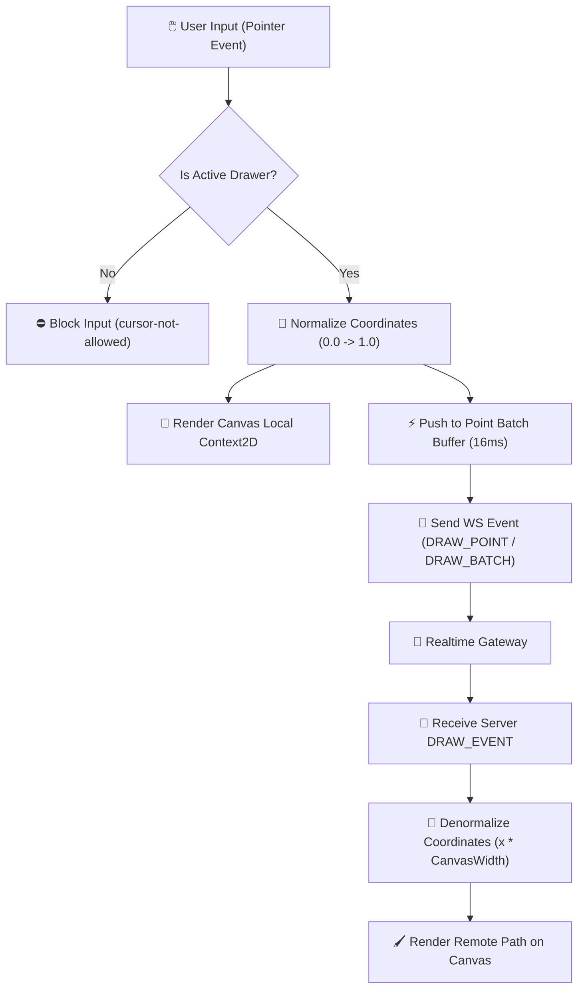
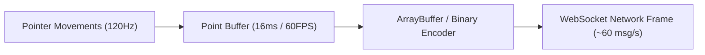
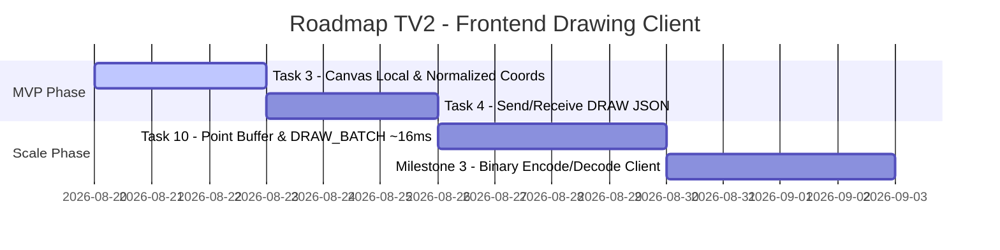

# 🎨 Member 02 Documentation: Frontend Realtime Drawing & HTML5 Canvas

<div align="center">


</div>

---

## 📌 Executive Summary

Tài liệu này chi tiết toàn bộ kiến trúc, thiết kế kỹ thuật, luồng xử lý và kế hoạch triển khai của **Thành viên 02 (TV2 - Frontend Realtime)** thuộc dự án *Multiplayer Drawing & Guessing Game*. 

Nhiệm vụ trọng tâm của TV2 là xây dựng hệ thống **HTML5 Canvas tương tác thời gian thực**, đảm bảo khả năng vẽ mượt mà phía người vẽ (Drawer), đồng bộ nét vẽ tức thì với các người chơi khác (Guessers) qua WebSocket với độ trễ tối thiểu, và hỗ trợ hiển thị chính xác trên mọi thiết me kích thước màn hình.

> [!NOTE]
> **Phạm vi trách nhiệm chính của TV2:**
> - Triển khai **HTML5 Canvas 2D Engine** tương tác thông qua `PointerEvents` (`pointerdown`, `pointermove`, `pointerup`).
> - Thực hiện **Chuẩn hóa Tọa độ (Coordinate Normalization)** theo tỷ lệ phần trăm ($0.0 \to 1.0$) để không phụ thuộc độ phân giải màn hình.
> - Xây dựng **Point Batching Buffer (~16ms / 60 FPS)** giúp giảm tần số gửi WebSocket packet mà vẫn giữ nét vẽ mượt.
> - Tích hợp **Binary Drawing Codec (ArrayBuffer)** giải mã nét vẽ nhị phân tần số cao.
> - Phát triển UI Toolbar cho Canvas: Bảng màu, độ dày nét, công cụ xóa bảng, mode phân quyền Drawer vs Guesser.

---

## 🏗️ 1. Architecture & Canvas Rendering Pipeline

Hệ thống Canvas Rendering phía Frontend được phân chia thành 2 phần chính: **Local Drawing Engine** (dành cho Drawer) và **Remote Stroke Sync** (dành cho Guesser).

### 🔄 Data Flow Architecture (Frontend Canvas Flow)



---

## 📐 2. Coordinate Normalization (Chuẩn Hóa Tọa Độ)

Để đảm bảo hình vẽ trên máy vẽ (VD: Màn hình 4K Desktop) hiển thị **chính xác 100%** trên máy nhận (VD: Màn hình Smartphone Retina), tất cả tọa độ nét vẽ đều được chuyển đổi sang dạng tỷ lệ tương đối.

> [!TIP]
> ### 🧮 Công thức chuyển đổi Tọa độ
> 
> **1. Phía Người Vẽ (Drawer - Normalization):**
> $$x_{normalized} = \frac{x_{pixel} - rect.left}{W_{canvas}}$$
> $$y_{normalized} = \frac{y_{pixel} - rect.top}{H_{canvas}}$$
> 
> **2. Phía Người Xem (Guesser - Denormalization):**
> $$x_{render} = x_{normalized} \times W_{local\_canvas}$$
> $$y_{render} = y_{normalized} \times H_{local\_canvas}$$

---

## 🧩 3. Component Specification: `DrawingCanvas.tsx`

Hợp phần `DrawingCanvas` được đóng gói độc lập, nhận vào các props phân quyền và callback đồng bộ.

### 📋 Props Interface Definition

```typescript
export interface DrawPoint {
  x: number;          // Tọa độ X (Normalized 0.0 - 1.0 hoặc Local Pixel)
  y: number;          // Tọa độ Y (Normalized 0.0 - 1.0 hoặc Local Pixel)
  color: string;      // Mã màu Hex (ví dụ: "#EF4444")
  size: number;       // Độ dày nét vẽ (pixel, ví dụ: 4)
  isNewPath: boolean; // true: PointerDown (bắt đầu đường mới), false: PointerMove
  timestamp?: number; // Unix timestamp (ms)
}

interface DrawingCanvasProps {
  isDrawer: boolean;                   // Flag phân quyền: true (Drawer), false (Guesser)
  onDrawPoint?: (point: DrawPoint) => void; // Callback gửi điểm vẽ lên WebSocket
  externalPoints?: DrawPoint[];        // Danh sách điểm vẽ đồng bộ từ server
}
```

---

## ⚡ 4. Tối Ưu Hiệu Năng & Batching Network

Gửi WebSocket message cho từng tọa độ chuột (`pointermove` phát tần số lên tới 120-240Hz) gây nghẽn mạng và lag giao diện. TV2 áp dụng chiến lược tối ưu 3 lớp:



> [!IMPORTANT]
> ### 🚀 Bảng so sánh hiệu năng trước và sau tối ưu
>
> | Chỉ số | Chưa Tối Ưu (Single Point JSON) | Đã Tối Ưu (Batching ~16ms) | Binary Protocol (Milestone 3) |
> | :--- | :---: | :---: | :---: |
> | **Message Frequency** | 120 - 200 msg/s | **~60 msg/s** | **~60 msg/s** |
> | **Frame Size** | ~120 Bytes / msg | ~250 Bytes / batch (5-8 pts) | **~32 Bytes / frame** |
> | **Bandwidth Usage** | ~24 KB/s | **~15 KB/s** | **~1.9 KB/s (Giảm 92%)** |
> | **UI Render Delays** | Có hiện tượng khựng nhẹ | **Mượt 60 FPS (rAF)** | **Mượt 60 FPS (rAF)** |

---

## 🎨 5. UI/UX Toolbar & Phân Quyền Trạng Thái

Giao diện Canvas cung cấp bộ công cụ điều khiển trực quan cho Drawer và hiển thị badge bảo vệ cho Guesser:

```text
+-----------------------------------------------------------------------+
|  🎨 Canvas Area (HTML5 Canvas 2D)                                     |
|  [Guesser Mode Indicator: 👀 View-only Mode (Guesser)]                |
+-----------------------------------------------------------------------+
| 🎨 Palette: [⚪] [⬛] [🔴] [🟠] [🟡] [🟢] [🔵] [🟣] [🌸]               |
| 📏 Size: [--O-----] (4px)                  [ 🗑️ Clear Canvas ]       |
+-----------------------------------------------------------------------+
```

### 🎛️ Chi tiết Toolbar Options:
- **Palette Màu (9 Colors):** `#f8fafc` (Trắng), `#0f172a` (Đen), `#ef4444` (Đỏ), `#f97316` (Cam), `#eab308` (Vàng), `#22c55e` (Xanh lá), `#3b82f6` (Xanh dương), `#a855f7` (Tím), `#ec4899` (Hồng).
- **Stroke Size Slider:** Cho phép điều chỉnh nét vẽ linh hoạt từ `2px` đến `20px`.
- **Mode Control:** 
  - **Drawer:** Con trỏ `cursor-crosshair`, cho phép vẽ & tương tác full toolbar.
  - **Guesser:** Con trỏ `cursor-not-allowed`, ẩn toolbar, hiển thị mảng thông báo *View-only Mode*.

---

## 🛠️ 6. Implementation Code Snippets

### 💻 Code Render Engine (`DrawingCanvas.tsx`)

```typescript
const drawPointOnCanvas = (point: DrawPoint) => {
  const canvas = canvasRef.current;
  if (!canvas) return;
  const ctx = canvas.getContext('2d');
  if (!ctx) return;

  ctx.strokeStyle = point.color || '#f8fafc';
  ctx.lineWidth = point.size || 4;
  ctx.lineCap = 'round';
  ctx.lineJoin = 'round';

  if (point.isNewPath) {
    ctx.beginPath();
    ctx.moveTo(point.x, point.y);
  } else {
    ctx.lineTo(point.x, point.y);
    ctx.stroke();
  }
};
```

---

## 📅 7. Roadmap & Task Breakdown (TV2)

> [!TIP]
> Các công việc được sắp xếp theo mốc ưu tiên phát triển từ MVP đến Nâng cao.



| Task | Tên Công Việc | Trạng Thái | Definition of Done (DoD) |
| :---: | :--- | :---: | :--- |
| **T3** | **Canvas local + Pointer Events** | `HOÀN THÀNH` | Drawer vẽ local mượt, hỗ trợ touch/mouse, resize canvas không vỡ hình. |
| **T4** | **Gửi/Nhận DRAW JSON Protocol** | `ĐANG LÀM` | 2 browser cùng room đồng bộ nét vẽ realtime qua Gateway. |
| **T10**| **Buffer ~16ms & DRAW_BATCH** | `CHỜ TRIỂN KHAI` | Giảm 60% số packet gửi đi mà nét vẽ vẫn đạt 60 FPS. |
| **M3** | **Binary ArrayBuffer Codec** | `CHỜ TRIỂN KHAI` | Enodode/Decode ArrayBuffer nhị phân phía client thành công. |

---

<div align="center">

<i>Tài liệu Kỹ thuật Hợp phần Frontend Drawing & Canvas (TV2) — Hệ thống Multiplayer Drawing Game</i>

</div>
