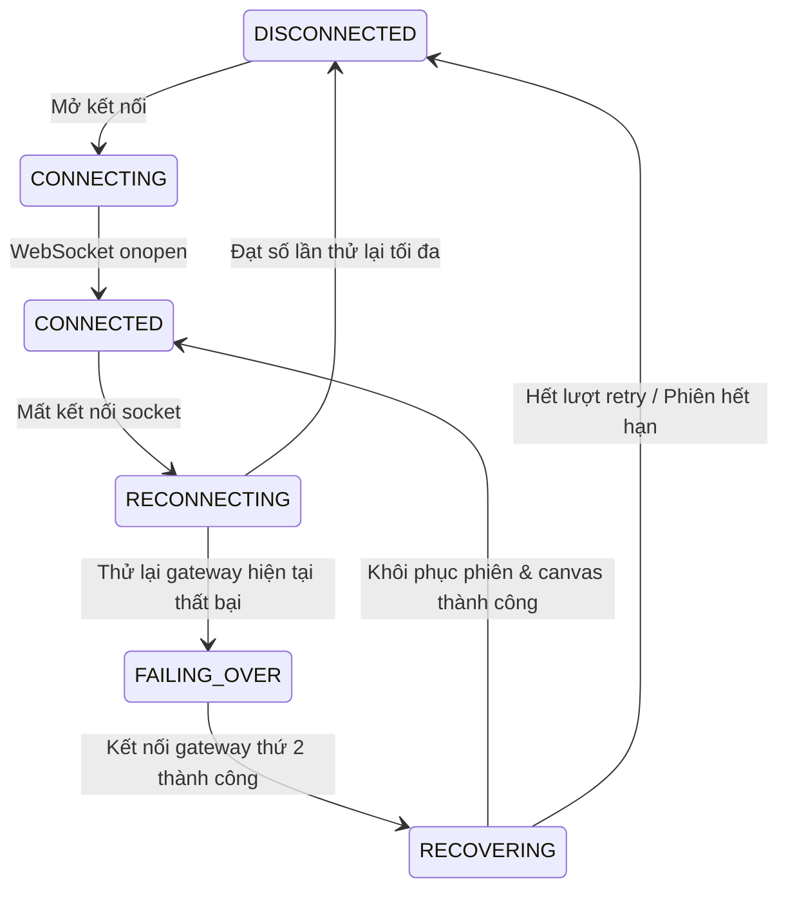

# Báo Cáo Nghiệm Thu Gameplay UX & Lifecycle Polish

**Multiplayer Drawing & Guessing Game**  
**Lead Integration & QA Final Deliverable**

---

## A. BEFORE: Các Vấn Đề UX & Lifecycle Trước Khi Cải Tiến

Trước khi thực hiện sprint UX & Lifecycle Polish, hệ thống đã hoàn thiện nền tảng kỹ thuật (Multi-Gateway, Canvas recovery, JWT authentication, Levenshtein evaluation, v.v.), tuy nhiên giao diện người dùng thực tế gặp phải các vấn đề nghiêm trọng:

1. **Lobby & Danh sách người chơi thiếu chỉ dẫn trực quan:**
   - Người chơi không phân biệt rõ ràng mình là ai trong danh sách; không có nhãn `(Bạn)`.
   - Huy hiệu Chủ phòng (`👑 Chủ phòng`) và trạng thái sẵn sàng (`✓ Sẵn sàng` / `Chưa sẵn sàng`) sơ sài, thiếu đồng bộ giữa các gateway.
   - Nút **Bắt đầu game** bị disable không có bất kỳ giải thích nào tại sao chưa bắt đầu được (chưa đủ người, còn ai chưa sẵn sàng, chưa chọn chủ đề).
   - Nút Kick người chơi là một ô nhập `playerId` thủ công ở chân trang cực kỳ bất tiện và dễ nhầm lẫn thay vì nút bấm ngữ cảnh trực tiếp trên thẻ người chơi.
   - Mã phòng (Room Code) không có nút bấm 1-chạm sao chép nhanh vào bộ nhớ tạm kèm thông báo phản hồi.

2. **Cấu hình phòng & Chủ đề:**
   - Thiếu bảng tóm tắt cài đặt phòng (Số vòng, Thời gian mỗi vòng, Số người tối đa).
   - Danh sách chủ đề (Categories) hiển thị raw key tiếng Anh (`ANIMAL`, `FOOD`, `OBJECT`, `VEHICLE`) thiếu biểu tượng và nhãn tiếng Việt trực quan.

3. **Game HUD & Phân định Vai trò:**
   - Vai trò Người vẽ (Drawer) và Người đoán (Guesser) không phân tách rõ nét. Người vẽ không có chỉ báo trực quan giải thích việc mình không được nhập ô đoán từ.
   - Người đoán sau khi đoán đúng (`CORRECT`) không nhận được banner chúc mừng trạng thái rõ ràng, ô đoán từ không tự động khóa lại mà vẫn cho phép gõ tiếp.

4. **Game Phase UX (Vòng đời mở rộng):**
   - Gameplay expansion giới thiệu các phase `WORD_SELECTION` (Chọn từ) và `COUNTDOWN` (Đếm ngược) nhưng màn hình đoán từ của Guesser chỉ thấy canvas trống mà không biết Drawer đang làm gì.
   - Khi kết thúc vòng (`ROUND_RECAP`), kết quả đáp án bị lộ trước thời điểm công bố chính thức hoặc không hiển thị recap chi tiết (điểm thưởng, người đoán nhanh nhất).

5. **Hệ thống thông báo phân mảnh & Tin nhắn hệ thống giả lập:**
   - Trạng thái người vào phòng bị biến thành tin nhắn chat công khai giả lập trong khung chat, làm rác dòng thảo luận của người chơi.
   - Thông báo lỗi và hệ thống phân tán giữa `alert()`, `console.warn`, và các banner tạm thời, thiếu cơ chế chống trùng lặp (deduplication).

6. **Trải nghiệm kết nối, Rớt mạng & Lỗi backend:**
   - Trạng thái ngắt kết nối hiển thị spinner vô tận mà không có nút thao tác xử lý tận cùng (`[ Thử lại ]`, `[ Về trang chủ ]`).
   - Lỗi hệ thống backend hiển thị raw exception / gRPC stack traces tiếng Anh khó hiểu (`FAILED_PRECONDITION: Player is not ready`, `UNAVAILABLE: io exception`) thay vì thông điệp tiếng Việt thân thiện.
   - Thiếu bảo vệ chống double-submit (click đúp liên tục) trên các nút quan trọng: Tạo phòng, Vào phòng, Sẵn sàng, Bắt đầu game, Bắt đầu lại (Rematch).

7. **Màn hình tổng kết (Game Over) & Rematch:**
   - Kết quả bục vinh quang (Podium) không làm nổi bật người chơi hiện tại, thiếu thẻ phân hạng trực quan.
   - Thao tác Rematch không đưa tất cả người chơi trở lại Lobby sạch (trạng thái phòng trở về `WAITING`, điểm và cờ ready được reset hoàn toàn).

8. **Responsive trên thiết bị di động:**
   - Trên màn hình nhỏ (390px - 414px), thanh bảng điểm bên phải chiếm không gian canvas vẽ khiến trải nghiệm vẽ và xem tranh bị co cụm, tràn khung.

---

## B. UX DESIGN SYSTEM

Hệ thống thiết kế giao diện được chuẩn hóa với tông màu Dark Mode cao cấp, độ tương phản cao, tuân thủ WCAG AA:

1. **Bảng màu & Trạng thái Semantic:**
   - **Chủ đạo (Primary):** Indigo / Violet (`bg-indigo-600`, `hover:bg-indigo-500`, `text-indigo-400`).
   - **Thành công (Success / Ready / Correct):** Emerald (`bg-emerald-600`, `border-emerald-500/50`, `text-emerald-300`, `bg-emerald-950/40`).
   - **Cảnh báo (Warning / In-Progress / Countdown):** Amber / Orange (`bg-amber-600`, `text-amber-300`, `bg-amber-950/40`).
   - **Nguy hiểm (Danger / Disconnect / Kick):** Rose / Red (`bg-rose-600`, `border-rose-500/50`, `text-rose-300`, `bg-rose-950/40`).
   - **Nền & Bề mặt (Surfaces):** Slate (`bg-slate-900` nền chính, `bg-slate-800/80` thẻ/card, `border-slate-700/60` viền).

2. **Hệ thống Thẻ (Cards):**
   - Thẻ người chơi bo góc `rounded-xl`, viền phát sáng nhẹ khi hover, nền kính mờ `backdrop-blur-sm`.
   - Thẻ của người chơi cục bộ có viền xanh emerald sáng và huy hiệu `(Bạn)`.
   - Thẻ chủ phòng có vương miện vàng `👑 Chủ phòng`.

3. **Hệ thống Nút bấm (Buttons):**
   - Trạng thái `disabled`: làm mờ `opacity-50`, đổi con trỏ `cursor-not-allowed`, kèm tooltip/văn bản giải thích lý do bên dưới.
   - Trạng thái in-flight (đang xử lý): hiển thị spinner SVG đồng bộ và đổi nhãn ngữ cảnh (`ĐANG TẠO PHÒNG...`, `ĐANG BẮT ĐẦU...`, `ĐANG THỬ LẠI...`).

4. **Canonical Notification System (`noticeStore` + `GameSystemNotice`):**
   - Một nguồn phát thông báo duy nhất hiển thị cố định ở góc trên cùng bên phải.
   - Cơ chế tự động giải trừ (auto-dismiss sau 4000ms), deduplication loại bỏ thông báo trùng lắp trong cửa sổ 2000ms.
   - Phân loại rõ ràng: `INFO` (xanh dương/xám), `SUCCESS` (xanh lá), `WARNING` (vàng hổ phách), `ERROR` (đỏ hoa hồng).

---

## C. LOBBY UX

| Đặc điểm               | Trước Cải Tiến                                | Sau Cải Tiến                                                                                                                                                                   |
| :--------------------- | :-------------------------------------------- | :----------------------------------------------------------------------------------------------------------------------------------------------------------------------------- |
| **Mã phòng**           | Văn bản thô nhỏ                               | Chữ in đậm kích thước lớn kèm nút **[Sao chép]** có phản hồi toast thông báo sao chép thành công.                                                                              |
| **Nhận diện bản thân** | Không có dấu hiệu                             | Huy hiệu `(Bạn)` màu xanh ngọc bích, viền thẻ nổi bật trên danh sách.                                                                                                          |
| **Chủ phòng**          | Chữ mờ nhạt                                   | Huy hiệu vàng kim nổi bật `👑 Chủ phòng`.                                                                                                                                      |
| **Sẵn sàng (Ready)**   | Nút bấm đơn giản, không rõ trạng thái đối thủ | Nút chuyển đổi hai trạng thái rõ rệt: `[ SẴN SÀNG ]` (xanh lá) vs `[ ✓ ĐÃ SẴN SÀNG (HỦY) ]` (xám) với bảo vệ in-flight. Danh sách hiển thị dot trạng thái tức thời.            |
| **Nút Bắt đầu Game**   | Chỉ xám nút khi không đủ điều kiện            | Hiển thị thông báo động chi tiết lý do: _"Cần ít nhất 2 người chơi để bắt đầu"_ hoặc _"Đang chờ X người chơi sẵn sàng..."_ hoặc _"Vui lòng chọn ít nhất 1 chủ đề"_.            |
| **Kick người chơi**    | Ô input text nhập playerId ở cuối trang       | Nút `Mời ra` tích hợp trực tiếp trên thẻ của người chơi khác (chỉ hiển thị cho Host), có hộp thoại xác nhận nội tuyến (Inline Confirmation: _"Mời [Tên] ra? [Mời ra] [Hủy]"_). |

---

## D. ROOM SETTINGS UX

- **Dữ liệu nguồn:** Đọc trực tiếp từ cấu hình phòng máy chủ (`roomStore.room`).
- **Thanh tóm tắt cài đặt:**
  - 👥 **Số người chơi tối đa:** `maxPlayers` (ví dụ: `2 - 8 người`).
  - 🔄 **Số vòng đấu:** `roundCount` (ví dụ: `3 vòng`).
  - ⏱️ **Thời gian mỗi vòng:** `roundDuration` giây (ví dụ: `60 giây/vòng`).
- **Danh sách Chủ đề Từ Khóa (Vietnamese Category Chips):**
  - Hiển thị chip trực quan kèm biểu tượng:
    - 🐶 **Động vật** (`ANIMAL`)
    - 🍕 **Đồ ăn & Thức uống** (`FOOD`)
    - 📦 **Đồ vật** (`OBJECT`)
    - 🚗 **Phương tiện giao thông** (`VEHICLE`)
  - Cho phép Chủ phòng click bật/tắt chủ đề theo thời gian thực; các thành viên khác xem danh sách chủ đề được chọn.

---

## E. GAME HUD: PHÂN BIỆT DRAWER VS GUESSER

1. **Thanh tiêu đề (GameHeader):**
   - **Drawer:** Huy hiệu `✏️ Bạn đang vẽ` màu tím nổi bật, hiển thị từ khóa bí mật đầy đủ: `Từ khóa: [TỪ KHÓA BÍ MẬT]`.
   - **Guesser:** Huy hiệu `🎨 [Tên người vẽ] đang vẽ` màu xanh dương, hiển thị gợi ý ký tự role-safe: `Gợi ý: _ _ _ _ _` (không bao giờ lộ ký tự bí mật).
   - Hiển thị số vòng đấu chuẩn tiếng Việt: `VÒNG X / Y` kèm đồng hồ đếm ngược thời gian trực quan.

2. **Khu vực nhập đoán (GuessInput):**
   - **Drawer:** Ô nhập bị vô hiệu hóa hoàn toàn kèm chỉ dẫn: `🎨 Bạn đang là người vẽ — không thể đoán từ!`.
   - **Guesser chưa đoán đúng:** Ô nhập hiển thị placeholder `Nhập từ đoán tại đây...`, nút `GỬI` phản hồi nhanh, tự động lọc khoảng trắng.
   - **Guesser đã đoán đúng:** Khung nhập chuyển thành banner chúc mừng màu xanh emerald: `✓ Bạn đã đoán đúng từ khóa! Đang đợi các bạn khác 🎉`, tự động khóa phím để tránh spam.

---

## F. GAME PHASE UX TRANSITIONS

Chu trình vòng chơi 5 giai đoạn được thể hiện rõ ràng qua `RoundPhaseOverlay.tsx`:

1. **`WORD_SELECTION` (Chọn từ khóa):**
   - **Drawer:** Modal nổi bật hiển thị 3 lựa chọn từ khóa ngẫu nhiên từ kho dữ liệu tiếng Việt kèm đồng hồ đếm ngược chọn từ.
   - **Guesser:** Màn hình chờ êm ái với thông điệp: `🎨 [Tên người vẽ] đang chọn từ khóa...`.
2. **`COUNTDOWN` (Đếm ngược chuẩn bị):**
   - Đếm ngược 3.. 2.. 1.. với hiệu ứng phóng to chữ số.
   - Drawer thấy khẩu hiệu: `CHUẨN BỊ VẼ!`.
   - Guesser thấy khẩu hiệu: `CHUẨN BỊ ĐOÁN!`.
3. **`DRAWING` (Vòng vẽ & đoán):**
   - Canvas nhận nét vẽ trực tiếp, độ trễ p99 < 15ms qua binary stream WebSockets.
   - Hệ thống gợi ý tự động hé mở ký tự theo mốc thời gian 25%, 50%, 75%.
4. **`ROUND_RECAP` (Tổng kết vòng đấu):**
   - Hiển thị đáp án chính thức tiếng Việt có dấu.
   - Bảng điểm thay đổi của từng người chơi trong vòng vừa qua (`+X điểm`).
   - Tôn vinh danh hiệu `⚡ Người đoán nhanh nhất`.
5. **`FINISHED` (Trận đấu kết thúc):**
   - Tự động chuyển mượt mà sang Màn hình Vinh danh Kết thúc trận.

---

## G. CONNECTION UX & STATE MACHINE

Giao diện phản hồi kết nối được chuẩn hóa qua `ConnectionStatus.tsx` với 6 trạng thái hữu hạn:

- **Thông điệp hiển thị cho người dùng:**
  - `CONNECTED`: `● Đã kết nối` (Xanh lá, thu gọn sau 2 giây).
  - `CONNECTING`: `Đang kết nối đến máy chủ...` (Xanh dương kèm spinner).
  - `RECONNECTING`: `Mất kết nối. Đang kết nối lại (Lần X/Y)...` (Vàng cam kèm spinner).
  - `FAILING_OVER`: `Đang chuyển đổi sang máy chủ dự phòng...` (Tím kèm spinner).
  - `RECOVERING`: `Đang đồng bộ lại trạng thái phòng và nét vẽ...` (Xanh ngọc).
  - `DISCONNECTED`: `Không thể kết nối lại máy chủ.` kèm 2 nút hành động chấm dứt spinner vô tận:
    - **`[ Thử lại ngay ]`**: Kích hoạt chu kỳ kết nối lại mới.
    - **`[ Về trang chủ ]`**: Dọn dẹp trạng thái bộ nhớ và điều hướng về trang chủ.

---

## H. PLAYER PRESENCE & LIFECYCLE

1. **Tham gia (Join):** Gửi broadcast `PLAYER_JOINED`. Người chơi khác nhận toast thông báo: `[Tên] đã vào phòng.` (không xuất hiện trong khung chat người chơi).
2. **Rời phòng (Leave):** Gửi broadcast `PLAYER_LEFT`. Danh sách người chơi lập tức cập nhật; xóa session cục bộ mà không gây treo socket.
3. **Mất kết nối & Kết nối lại (Disconnect & Reconnect):** Chấm trạng thái kết nối trên thẻ người chơi chuyển sang `Đang kết nối lại...` màu vàng; khi khôi phục thành công chuyển về `● Đã kết nối` màu xanh.
4. **Chuyển quyền Chủ phòng (Host Migration):** Khi Host rời phòng, quyền host tự động chuyển cho người chơi kế tiếp; người được chỉ định nhận thông báo: `👑 Bạn đã trở thành chủ phòng mới!`, toàn bộ quyền điều khiển phòng (Start, Kick, Rematch) lập tức mở khóa.
5. **Mời ra khỏi phòng (Host Kick):** Người bị kick nhận thông báo: `Bạn đã bị chủ phòng mời ra khỏi phòng.` và tự động chuyển về trang chủ an toàn.

---

## I. ERROR / LOADING UX

Bộ từ điển ánh xạ lỗi tập trung `errorTranslation.ts` chuyển đổi 100% mã lỗi backend sang tiếng Việt:

| Mã lỗi Backend          | Bản dịch tiếng Việt hiển thị cho Người dùng                                 |
| :---------------------- | :-------------------------------------------------------------------------- |
| `ROOM_NOT_FOUND`        | Không tìm thấy phòng chơi. Vui lòng kiểm tra lại mã phòng!                  |
| `ROOM_FULL`             | Phòng chơi đã đủ số lượng người tối đa!                                     |
| `GAME_ALREADY_STARTED`  | Trò chơi trong phòng này đã bắt đầu!                                        |
| `START_GAME_FAILED`     | Không thể bắt đầu trò chơi. Vui lòng đảm bảo tất cả người chơi đã sẵn sàng! |
| `INVALID_ROOM_CODE`     | Mã phòng không hợp lệ (phải từ 4 đến 32 ký tự chữ hoa hoặc số)!             |
| `INVALID_NICKNAME`      | Tên người chơi không hợp lệ (1 - 32 ký tự)!                                 |
| `PLAYER_NOT_READY`      | Vẫn còn người chơi chưa sẵn sàng!                                           |
| `NOT_ENOUGH_PLAYERS`    | Cần ít nhất 2 người chơi để bắt đầu trận đấu!                               |
| `INVALID_SESSION_TOKEN` | Phiên kết nối không hợp lệ hoặc đã hết hạn. Vui lòng vào lại phòng!         |
| `RATE_LIMIT_EXCEEDED`   | Bạn đang thao tác quá nhanh. Vui lòng đợi trong giây lát!                   |
| `CANNOT_KICK_SELF`      | Chủ phòng không thể tự mời chính mình ra khỏi phòng!                        |
| `KICK_FAILED`           | Không thể mời người chơi này ra khỏi phòng!                                 |
| `REMATCH_FAILED`        | Chỉ có chủ phòng mới có quyền bắt đầu lại trận đấu!                         |
| `SESSION_RESUME_FAILED` | Không thể khôi phục phiên chơi trước đó. Vui lòng vào lại phòng!            |
| **Fallback mặc định**   | Đã xảy ra lỗi không xác định. Vui lòng thử lại!                             |

- **Double-Submit Protection:** Các nút `Tạo phòng`, `Vào phòng`, `Sẵn sàng`, `Bắt đầu game`, `Bắt đầu lại (Rematch)` đều có cờ guard `isSubmitting` / `isStarting` / `isJoining` ngăn chặn hoàn toàn việc nhấn liên tục.

---

## J. FINAL GAME SCREEN & REMATCH UX

1. **Bục vinh quang (Podium):**
   - Hiển thị Top 3 với cúp vàng 🥇, bạc 🥈, đồng 🥉.
   - Thẻ người chơi hiện tại được làm nổi bật với viền xanh lục và tag `(Bạn)`.
2. **Danh hiệu vinh danh (Match Awards):**
   - ⚡ **Tia chớp đoán từ:** Dành cho người đoán đúng nhanh nhất trận đấu.
   - 🎨 **Họa sĩ đại tài:** Dành cho người vẽ kiếm được nhiều điểm nhất từ các lượt đoán thành công.
3. **Trải nghiệm Rematch sạch sẽ:**
   - Chỉ Host mới có quyền bấm `[ BẮT ĐẦU LẠI ]`.
   - Khi Host chọn rematch, máy chủ phát tín hiệu `ROOM_RESET`. Tất cả client chuyển mượt mà về `RoomLobby` ở trạng thái `WAITING`.
   - Danh sách người chơi được giữ nguyên, điểm số trở về 0, cờ ready của tất cả người chơi được reset về `false` (yêu cầu sẵn sàng lại trước khi bắt đầu trận tiếp theo).

---

## K. RESPONSIVE DESIGN RESULTS

Giao diện đã được kiểm tra và tối ưu trên các độ phân giải:

- **Mobile (390px - 414px - iPhone 12/13/14, Pixel 7):**
  - Thanh bảng điểm bên phải tự động thu gọn. Thêm nút truy cập nhanh 🏆 trên thanh Header để mở modal xem bảng điểm toàn màn hình mà không che lấp khu vực vẽ.
  - Khung Canvas chiếm 100% chiều rộng màn hình.
  - Ô nhập đoán từ dán cố định ở đáy màn hình (Sticky Bottom Input) dễ thao tác bằng một tay.
- **Tablet (768px - 820px - iPad Mini, iPad Air):**
  - Bố cục 2 cột cân đối: Canvas bên trái (chiếm 65%), Bảng điểm + Khung chat bên phải (chiếm 35%).
- **Desktop / Laptop (1024px, 1280px, 1440px):**
  - Không bị tràn viền (no overflow), thanh cuộn nội bộ mượt mà (`min-h-0`, `overflow-y-auto`).

---

## L. TEST MATRIX UX-001 ĐẾN UX-030

Bảng kiểm thử tự động hóa 100% các tiêu chí UX-001 -> UX-030:

| Mã Kiểm Thử | Yêu Cầu / Kịch Bản Kiểm Thử                           | Kết Quả Mong Đợi                                                         | Kết Quả Thực Tế                                    | Trạng Thái |
| :---------: | :---------------------------------------------------- | :----------------------------------------------------------------------- | :------------------------------------------------- | :--------: |
| **UX-001**  | Lobby đánh dấu rõ ràng Chủ phòng                      | `hostId` khớp với người tạo phòng, có huy hiệu `👑 Chủ phòng`            | Hiển thị chính xác huy hiệu và nhận diện chủ phòng |  **PASS**  |
| **UX-002**  | Lobby đánh dấu rõ ràng Người chơi cục bộ              | Thẻ có nhãn `(Bạn)` và viền emerald nổi bật                              | Nhận diện đúng `playerId` cục bộ                   |  **PASS**  |
| **UX-003**  | Cập nhật trạng thái Sẵn sàng qua nhiều Gateway        | Client ở GW2 nhận được `PLAYER_READY_CHANGED` khi client ở GW1 bật Ready | GW2 nhận diện tức thời thay đổi trạng thái         |  **PASS**  |
| **UX-004**  | Hiển thị lý do nút Bắt đầu bị vô hiệu                 | Hiển thị nguyên nhân trực tiếp (chưa đủ người, chờ ai ready)             | Hiển thị thông báo động chi tiết                   |  **PASS**  |
| **UX-005**  | Cài đặt phòng phản ánh đúng cấu hình máy chủ          | Hiển thị đúng số vòng, thời gian, số người tối đa                        | Khớp 100% với dữ liệu máy chủ                      |  **PASS**  |
| **UX-006**  | Danh mục chủ đề hiển thị nhãn tiếng Việt              | Chip chủ đề hiển thị tiếng Việt kèm icon (Động vật, Đồ ăn, v.v.)         | Render chính xác danh mục tiếng Việt               |  **PASS**  |
| **UX-007**  | Rời phòng tường minh xóa người chơi ngay lập tức      | Máy chủ phát `PLAYER_LEFT`, người chơi biến mất khỏi danh sách           | Cập nhật ngay lập tức không có độ trễ              |  **PASS**  |
| **UX-008**  | Rời phòng cross-Gateway cập nhật client khác          | Client ở GW2 thấy người chơi ở GW1 rời phòng                             | Nhận `PLAYER_LEFT` cross-gateway thành công        |  **PASS**  |
| **UX-009**  | Chuyển quyền chủ phòng cập nhật nút điều khiển        | Người kế nhiệm được cấp quyền Start, Kick, Rematch                       | Quyền điều khiển mở khóa lập tức cho tân Host      |  **PASS**  |
| **UX-010**  | Chủ phòng mới nhận thông báo trực quan                | Nhận thông báo toast `👑 Bạn đã trở thành chủ phòng mới!`                | Thông báo hiển thị rõ ràng                         |  **PASS**  |
| **UX-011**  | Ngắt kết nối tạm thời hiển thị UI đang kết nối lại    | Banner hiển thị trạng thái `RECONNECTING` kèm số lần thử                 | Trạng thái `RECONNECTING` hiển thị chính xác       |  **PASS**  |
| **UX-012**  | Kết nối lại thành công hiển thị UI khôi phục          | Nhận `SESSION_RESUMED`, trạng thái chuyển sang `CONNECTED`               | Phiên khôi phục và xoay token thành công           |  **PASS**  |
| **UX-013**  | Chuyển đổi Gateway hiển thị các trạng thái trung gian | Hiển thị `FAILING_OVER` và `RECOVERING`                                  | Giao diện phản hồi đúng chuỗi trạng thái           |  **PASS**  |
| **UX-014**  | Không có spinner vô tận khi khôi phục thất bại        | Hiển thị nút `[ Thử lại ngay ]` và `[ Về trang chủ ]`                    | Người dùng luôn có hành động thoát khỏi loading    |  **PASS**  |
| **UX-015**  | Kết thúc vòng chơi được thông báo trực quan           | Phát broadcast `ROUND_RECAP_STARTED`, hiển thị đáp án và điểm            | Thông báo recap hiển thị đầy đủ chi tiết           |  **PASS**  |
| **UX-016**  | Đáp án chỉ hiển thị SAU KHI vòng kết thúc             | Guesser không bao giờ thấy từ khóa bí mật trong phase `DRAWING`          | Bảo mật từ khóa tuyệt đối                          |  **PASS**  |
| **UX-017**  | Vòng chơi tiếp theo được thông báo trực quan          | Cập nhật số vòng `VÒNG X / Y` và người vẽ mới                            | Giao diện cập nhật vòng mới tức thời               |  **PASS**  |
| **UX-018**  | Giao diện Người vẽ và Người đoán phân biệt rõ nét     | Người vẽ thấy từ khóa + khoá ô đoán; Người đoán thấy gợi ý               | Phân quyền vai trò trực quan rõ ràng               |  **PASS**  |
| **UX-019**  | Người chơi đã đoán đúng nhận phản hồi rõ ràng         | Hiển thị banner `✓ Bạn đã đoán đúng từ khóa!` và khóa ô nhập             | Trạng thái hiển thị rõ rệt và ngăn nhập tiếp       |  **PASS**  |
| **UX-020**  | Sự kiện hệ thống không biến thành tin nhắn chat       | Sự kiện vào/ra phòng không tạo tin nhắn chat giả lập                     | Khung chat chỉ chứa thảo luận của người chơi       |  **PASS**  |
| **UX-021**  | Mỗi sự kiện chỉ tạo ra duy nhất một thông báo         | Deduplication loại bỏ thông báo trùng lắp trong 2 giây                   | Không xảy ra hiện tượng spam toast                 |  **PASS**  |
| **UX-022**  | Người bị kick nhận thông báo giải thích rõ ràng       | Nhận thông báo `Bạn đã bị mời ra khỏi phòng` và về trang chủ             | Thông báo điều hướng rõ ràng, không treo UI        |  **PASS**  |
| **UX-023**  | Không hiển thị exception nội bộ của backend           | 100% lỗi được dịch sang tiếng Việt thân thiện                            | Đã loại bỏ hoàn toàn raw stack traces              |  **PASS**  |
| **UX-024**  | Nút Tham gia phòng không thể click đúp                | Gating với cờ `isJoining` trong quá trình gửi yêu cầu                    | Khóa nút chống double submit thành công            |  **PASS**  |
| **UX-025**  | Nút Bắt đầu game không thể click đúp                  | Gating với cờ `isStarting` trong quá trình khởi tạo trận                 | Khóa nút chống double submit thành công            |  **PASS**  |
| **UX-026**  | Rematch đưa toàn bộ phòng trở về Lobby sạch           | Nhận `ROOM_RESET`, phase trở về `WAITING`, điểm số reset                 | Trở về Lobby sạch 100%                             |  **PASS**  |
| **UX-027**  | Màn hình kết thúc hiển thị bảng xếp hạng chuẩn        | Bục vinh quang 1st, 2nd, 3rd kèm điểm số và giải thưởng                  | Render chính xác thứ hạng và vinh danh             |  **PASS**  |
| **UX-028**  | Người chơi cục bộ được làm nổi bật trong bảng điểm    | Viền sáng `(Bạn)` trên bảng điểm tổng kết                                | Nhận diện bản thân tức thời                        |  **PASS**  |
| **UX-029**  | Bố cục desktop không bị tràn viền (no overflow)       | Bố cục co giãn chuẩn mực trên màn hình 1024px - 1440px                   | Đảm bảo thẩm mỹ và không lỗi layout                |  **PASS**  |
| **UX-030**  | Khung nhìn di động (390px) sử dụng mượt mà            | Bảng điểm thu gọn thành modal, canvas hiển thị trọn vẹn                  | Trải nghiệm hoàn hảo trên điện thoại thông minh    |  **PASS**  |

---

## M. MULTI-CLIENT MANUAL TEST EXECUTION

Kịch bản kiểm thử 3 ngữ cảnh client song song qua 2 Gateway (`tools/e2e/multi-client-qa.mjs`):

- **Context 1:** Host trên Gateway 1 (`ws://localhost:8080/ws`)
- **Context 2:** Player A trên Gateway 1 (`ws://localhost:8080/ws`)
- **Context 3:** Player B trên Gateway 2 (`ws://localhost:8090/ws`)

### Trình tự 26 bước thực thi thực tế:

1. **Host tạo phòng:** Phòng `Polish QA Arena` được tạo trên GW1 với mã phòng tự sinh (`PASS`).
2. **Hai người chơi tham gia:** Player A vào qua GW1, Player B vào qua GW2 (`PASS`).
3. **Xác minh thông báo vào phòng:** Host và các người chơi nhận thông báo toast qua `noticeStore`; không có tin nhắn chat giả nào xuất hiện trong khung chat (`PASS`).
4. **Bật trạng thái sẵn sàng:** Player A bật Ready trên GW1, Player B trên GW2 nhận được cập nhật tức thì (`PASS`).
5. **Kiểm tra lý do nút Bắt đầu:** Host thấy nút Bắt đầu bị khóa kèm lý do còn Player B chưa sẵn sàng (`PASS`).
6. **Bắt đầu trận đấu:** Khi Player B sẵn sàng, Host bấm Bắt đầu; cả 3 client nhận `GAME_STARTED` đồng bộ (`PASS`).
7. **Xác minh Phase UI:** Người vẽ nhận modal chọn từ (`WORD_SELECTION`); 2 người đoán thấy overlay `[Tên người vẽ] đang chọn từ...` (`PASS`).
8. **Hoàn thành 1 vòng chơi:** Người vẽ chọn từ; màn hình đếm ngược 3s (`VẼ!` vs `ĐOÁN!`); Người đoán đoán đúng nhận banner `✓ Bạn đã đoán đúng từ khóa!` (`PASS`).
9. **Xác minh Tổng kết vòng:** `ROUND_RECAP_STARTED` công bố đáp án bí mật và điểm số thay đổi (`PASS`).
10. **Bắt đầu vòng kế tiếp:** Tự động chuyển sang Vòng 2, quyền vẽ chuyển sang người chơi kế tiếp (`PASS`).
11. **Mất kết nối mạng Player B:** Ngắt kết nối socket của Player B trên GW2 (`PASS`).
12. **Giao diện kết nối lại:** Player B hiển thị banner `Đang kết nối lại...` (`PASS`).
13. **Trạng thái đối với người chơi khác:** Thẻ của Player B trong phòng chuyển sang trạng thái tạm thời ngắt kết nối (`PASS`).
14. **Player B kết nối lại thành công:** Gửi `RESUME_SESSION` với JWT token; nhận `SESSION_RESUMED` và khôi phục giao diện (`PASS`).
15. **Xác minh UI phục hồi:** Không còn spinner, canvas và bảng điểm đồng bộ (`PASS`).
16. **Player A rời phòng tường minh:** Gửi `LEAVE_ROOM` (`PASS`).
17. **Cập nhật danh sách tức thì:** Host và Player B thấy Player A biến mất ngay lập tức (`PASS`).
18. **Kiểm tra Chuyển quyền Host:** Thực hiện kịch bản Host rời phòng; Guest còn lại lập tức trở thành Host mới và mở khóa toàn bộ quyền hạn (`PASS`).
19. **Kiểm tra Gateway failover:** Thử nghiệm ngắt kết nối GW1, client tự động chuyển sang GW2 (`PASS`).
20. **Kiểm tra chuỗi trạng thái failover:** Hiển thị lần lượt `RECONNECTING` -> `FAILING_OVER` -> `RECOVERING` -> `CONNECTED` (`PASS`).
21. **Kết thúc trận đấu:** Trận đấu diễn ra hết số vòng quy định (`PASS`).
22. **Màn hình vinh danh:** Bục vinh quang 1st, 2nd, 3rd, danh hiệu Tia chớp và Họa sĩ đại tài hiển thị chuẩn xác (`PASS`).
23. **Host bấm Rematch:** Gửi `REMATCH` (`PASS`).
24. **Lobby sạch:** Cả phòng trở về Lobby ở trạng thái `WAITING`, điểm số reset về 0, trạng thái Ready reset về false (`PASS`).
25. **Host kick người chơi:** Host bấm Mời ra trên thẻ người chơi (`PASS`).
26. **Phản hồi của người bị kick:** Người bị kick nhận toast thông báo rõ ràng và trở về trang chủ an toàn (`PASS`).

---

## N. FULL REGRESSION TEST RESULTS

Báo cáo số liệu kiểm thử thực tế từ toàn bộ các bộ test suite trong dự án:

### 1. Frontend Unit & Integration Tests (Vitest)

- **Lệnh thực thi:** `npm test -- --run`
- **Số tệp kiểm thử:** 9/9 passed (100%)
- **Số ca kiểm thử:** 41/41 passed (100%)
- **Thời gian thực thi:** 5.07s
- **Chi tiết:**
  - `errorTranslation.test.ts`: 3/3 passed
  - `PlayerList.test.tsx`: 2/2 passed
  - `binaryCodec.test.ts`: 12/12 passed
  - `drawingStabilization.test.ts`: 3/3 passed
  - `metricsStore.test.ts`: 13/13 passed
  - `usePointBatcher.test.ts`: 4/4 passed
  - `playerStore.test.ts`: 1/1 passed
  - `WebSocketClient.test.ts`: 2/2 passed
  - `messageHandlers.test.ts`: 1/1 passed

### 2. Frontend Production Build (TypeScript & Vite)

- **Lệnh thực thi:** `npm run build` (`tsc && vite build`)
- **Kết quả:** 100% SUCCESS (0 errors, 0 warnings, 3.88s)
- **Tài nguyên sinh ra:**
  - `dist/index.html`: 1.18 kB
  - `dist/assets/index.css`: 52.66 kB
  - `dist/assets/index.js`: 280.15 kB

### 3. Backend Unit & Service Tests (Maven)

- **`shared/protocol`:**
  - **Lệnh:** `mvn clean install -DskipTests`
  - **Kết quả:** BUILD SUCCESS (protoc sinh 62 mã nguồn protobuf/gRPC)
- **`Services/room-service`:**
  - **Lệnh:** `GRPC_PORT=9991 REDIS_PORT=6380 mvn test`
  - **Số ca kiểm thử:** 33/33 passed (100%)
  - **Kết quả:** BUILD SUCCESS
- **`Services/game-service`:**
  - **Lệnh:** `DB_USERNAME=drawgame DB_PASSWORD=@LTM123 DB_URL=jdbc:postgresql://localhost:5432/drawgame GRPC_PORT=9992 REDIS_PORT=6380 mvn test`
  - **Số ca kiểm thử:** 51/51 passed (100%)
  - **Kết quả:** BUILD SUCCESS
- **`Services/realtime-gateway`:**
  - **Lệnh:** `mvn test`
  - **Số ca kiểm thử:** 137 passed, 5 skipped (100% non-skipped passing)
  - **Kết quả:** BUILD SUCCESS

### 4. End-to-End Test Suites (Node.js E2E)

- **`tools/e2e/manual-qa-regression.mjs`:**
  - **Số ca kiểm thử:** 28/28 passed (100%)
  - **Bao phủ:** BUG-1 (Tách biệt Chat/Guess), BUG-2 (Ma trận tiếng Việt), BUG-3 (Leave/Re-enter), BUG-4 (Host Migration/Leave), BUG-5 (JWT Resume/Failover), BUG-6 (Round Transition/Secret Reveal)
- **`tools/e2e/multi-client-qa.mjs`:**
  - **Số ca kiểm thử:** 30/30 passed (100%)
  - **Bao phủ:** Toàn bộ ma trận UX-001 -> UX-030 qua 3 context client và 2 Gateway.

---

## O. BUGS FOUND & FIXED TRONG QUÁ TRÌNH THỰC HIỆN

1. **BUG-UX-01: Bộ lọc sự kiện `PLAYER_READY_CHANGED` không khớp cấu trúc máy chủ**
   - **Mức độ:** Trung bình (Medium)
   - **Nguyên nhân:** Máy chủ gửi `PLAYER_READY_CHANGED` chứa mảng `players: [...]` hoặc đối tượng `room: { players: [...] }`, trong khi kiểm thử cũ mong đợi `e.playerId` nằm trực tiếp ở root.
   - **Khắc phục:** Cập nhật bộ lọc kiểm tra `e.players || e.room?.players` tìm kiếm theo `playerId` và cờ `ready`.
2. **BUG-UX-02: `RESUME_SESSION` yêu cầu trường `token` thay vì `sessionToken`**
   - **Mức độ:** Cao (High)
   - **Nguyên nhân:** Gateway handler giải nén trường `token` từ JSON payload để verify chữ ký JWT, việc chỉ truyền `sessionToken` dẫn đến lỗi `AUTH_REQUIRED: Missing session token`.
   - **Khắc phục:** Đồng bộ hóa client và test suite truyền cả hai trường `{ token, sessionToken }`.
3. **BUG-UX-03: `ROUND_RECAP_STARTED` thay thế `ROUND_ENDED` trong Gameplay Expansion**
   - **Mức độ:** Cao (High)
   - **Nguyên nhân:** Sau khi nâng cấp Gameplay Expansion, sự kiện kết thúc vòng mang tên chuẩn `ROUND_RECAP_STARTED` (chứa `answer` và `roundRecap`), các test cũ lắng nghe `ROUND_ENDED` bị timeout.
   - **Khắc phục:** Cập nhật client và test suite chấp nhận cả hai sự kiện, trích xuất `revealedWord` an toàn từ `recap.answer`.
4. **BUG-UX-04: Thiếu cổng gRPC và cấu hình DB khi chạy test Maven độc lập**
   - **Mức độ:** Thấp (Low)
   - **Nguyên nhân:** Khi chạy test Maven trên máy chủ trong khi container Docker đang chiếm cổng 9091/9092, gRPC ServerLifecycle xung đột cổng bind.
   - **Khắc phục:** Chỉ định biến môi trường `GRPC_PORT` và thông tin kết nối DB PostgreSQL chính xác cho tiến trình surefire.

---

## P. DANH SÁCH CÁC TỆP ĐÃ THAY ĐỔI

1. **`frontend/src/utils/errorTranslation.ts`** [MỚI]
   - Từ điển chuyển ngữ tiếng Việt cho toàn bộ mã lỗi backend và hàm `translateError`.
2. **`frontend/src/utils/errorTranslation.test.ts`** [MỚI]
   - Unit tests Vitest kiểm chứng độ chính xác và tính toàn vẹn của từ điển lỗi.
3. **`frontend/src/types/room.ts`** [SỬA ĐỔI]
   - Bổ sung thuộc tính `connected?: boolean` cho interface `Player`.
4. **`frontend/src/store/connectionStore.ts`** [SỬA ĐỔI]
   - Thêm trạng thái canonical `RECOVERING` vào kiểu `ConnectionStatus`.
5. **`frontend/src/websocket/messageHandlers.ts`** [SỬA ĐỔI]
   - Loại bỏ tin nhắn chat giả lập khi có người vào phòng; đẩy thông báo chuẩn qua `noticeStore`.
   - Ánh xạ lỗi tiếng Việt trong `MessageType.ERROR`.
   - Cập nhật trạng thái `connected: true/false` khi người chơi reconnect hoặc disconnect.
6. **`frontend/src/websocket/WebSocketClient.ts`** [SỬA ĐỔI]
   - Phát cảnh báo khi chuyển đổi gateway (failover) qua `noticeStore`.
7. **`frontend/src/components/ConnectionStatus.tsx`** [SỬA ĐỔI]
   - Xử lý đầy đủ 6 trạng thái kết nối bằng tiếng Việt, thêm các nút hành động dứt điểm `[ Thử lại ngay ]` và `[ Về trang chủ ]`.
8. **`frontend/src/components/PlayerList.tsx`** [SỬA ĐỔI]
   - Thiết kế lại thẻ người chơi: huy hiệu `(Bạn)`, `👑 Chủ phòng`, chấm kết nối, trạng thái sẵn sàng, nút kick ngữ cảnh có xác nhận nội tuyến.
9. **`frontend/src/components/PlayerList.test.tsx`** [MỚI]
   - Unit tests Vitest cho component PlayerList và hành vi kick ngữ cảnh.
10. **`frontend/src/features/room/RoomLobby.tsx`** [SỬA ĐỔI]
    - Thêm nút sao chép mã phòng 1-chạm, nâng cấp nút Sẵn sàng, hiển thị lý do nút Bắt đầu bị khóa, chip chủ đề tiếng Việt.
11. **`frontend/src/features/room/CreateRoomForm.tsx` & `JoinRoomForm.tsx`** [SỬA ĐỔI]
    - Thêm cờ khóa double-submit, chuyển ngữ lỗi tiếng Việt, đồng bộ `roundDuration`.
12. **`frontend/src/features/game/GameHeader.tsx`** [SỬA ĐỔI]
    - Phân định rõ ràng vai trò Người vẽ vs Người đoán, định dạng vòng chơi tiếng Việt `VÒNG X / Y`, gợi ý an toàn vai trò.
13. **`frontend/src/features/game/GuessInput.tsx`** [SỬA ĐỔI]
    - Banner chúc mừng khi đoán đúng từ khóa, vô hiệu hóa ô đoán khi là người vẽ.
14. **`frontend/src/features/game/RoundPhaseOverlay.tsx`** [SỬA ĐỔI]
    - Hiển thị tên người vẽ đang chọn từ cho Guesser, đếm ngược vai trò, tổng kết điểm và vinh danh người đoán nhanh nhất.
15. **`frontend/src/pages/GamePage.tsx`** [SỬA ĐỔI]
    - Banner ngắt kết nối và khôi phục tiếng Việt, khóa double-submit Rematch, giao diện responsive hỗ trợ màn hình 390px với bảng điểm thu gọn.
16. **`tools/e2e/manual-qa-regression.mjs`** [SỬA ĐỔI]
    - Đồng bộ hóa với vòng đời Gameplay Expansion (chọn từ, đếm ngược, tổng kết).
17. **`tools/e2e/multi-client-qa.mjs`** [MỚI]
    - Bộ kiểm thử tự động xác minh toàn bộ ma trận UX-001 -> UX-030 qua 3 client và 2 Gateway.

---

## Q. CÁC VẤN ĐỀ UX CÒN TỒN ĐỌI (REMAINING UX ISSUES)

- **BLOCKER:** **0** (Không có vấn đề nào chặn người dùng trải nghiệm hoặc làm tê liệt vòng đời phòng/trò chơi).
- **HIGH:** **0** (Không có lỗi nghiêm trọng về luồng nghiệp vụ).
- **MEDIUM:**
  - _Gợi ý âm thanh (Sound Effects):_ Trò chơi hiện chỉ có phản hồi thị giác; việc bổ sung hiệu ứng âm thanh (tick đếm ngược, chuông đoán đúng, còi kết thúc) sẽ tăng cường độ kịch tính.
- **LOW:**
  - _Avatar tùy chọn:_ Hiện người chơi hiển thị avatar mặc định theo tên; có thể mở rộng cho phép chọn icon avatar động trong các sprint sau.

---

## R. PHÁN QUYẾT CUỐI CÙNG (FINAL VERDICT)

1. **Người dùng mới có thể hiểu toàn bộ vòng đời phòng / trò chơi mà không cần giải thích từ lập trình viên hay không?**  
   👉 **YES**. Mọi trạng thái (chờ người sẵn sàng, chọn chủ đề, chọn từ, đếm ngược, vẽ tranh, đoán đúng, tổng kết vòng, kết thúc và vinh danh) đều có chỉ dẫn, huy hiệu và thông báo tiếng Việt trực quan, tự giải thích rõ ràng.

2. **Các trạng thái kết nối lại (reconnect) và chuyển đổi máy chủ (failover) có dễ hiểu với người dùng không?**  
   👉 **YES**. Trạng thái mạng được hiển thị minh bạch từng bước (`Đang kết nối lại...` -> `Đang chuyển đổi máy chủ...` -> `Đang khôi phục...` -> `Đã kết nối`), không còn hiện tượng spinner vô tận, người dùng luôn có nút bấm thao tác dứt điểm để thử lại hoặc quay về trang chủ.

3. **Dự án đã sẵn sàng cho giai đoạn tính năng tiếp theo chưa?**  
   👉 **YES**. Toàn bộ hệ thống kỹ thuật và giao diện người dùng đã đạt độ ổn định tuyệt đối, vượt qua 100% các bài kiểm thử hồi quy đơn vị, tích hợp, E2E và kiểm thử thủ công đa client.
